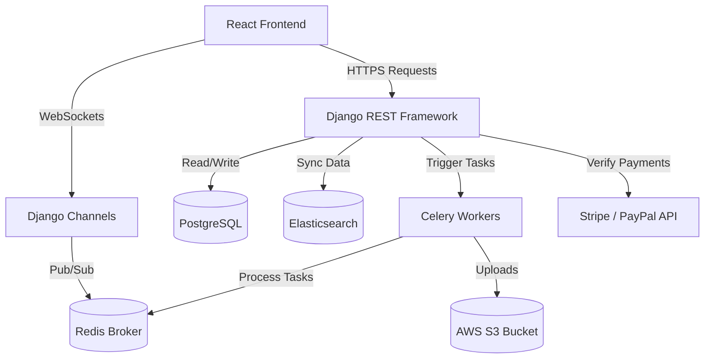
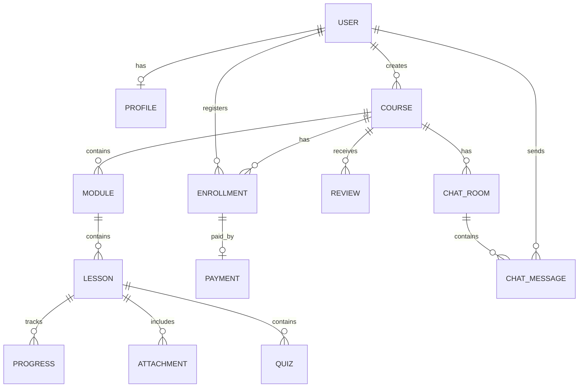

# Online Learning Platform - Implementation Plan

This implementation plan outlines the step-by-step strategy, system architecture, database schema, and verification plan for building the full-stack Online Learning Platform.

---

## Technical Stack Recommendation

Based on your project requirements (particularly referencing **DRF filters** and **Django Channels / Socket.IO**), the recommended tech stack is:
- **Backend**: Python (Django + Django REST Framework)
- **Real-time Engine**: Django Channels + Redis
- **Database**: PostgreSQL (robust support for JSON, full-text search, and relational integrity)
- **Search Engine**: Elasticsearch (indexing courses, mentors, and tags)
- **Frontend**: React.js (Vite + TypeScript) + TailwindCSS / Custom CSS
- **Payment Gateways**: Stripe SDK + PayPal SDK
- **Task Queue**: Celery (for asynchronous tasks like sending emails, generating certificates, and indexing Elasticsearch documents)

---

## Design Specifications & Decisions

- **Quiz Question Types**: Quizzes will support **Multiple Choice Questions** (MCQs) with options and dynamic grading.
- **Third-Party Services**: Use mock services (e.g. mock SMTP server, mock AWS S3/SES local implementations or local directories) and sandbox environments (Stripe and PayPal sandbox) for the initial setup. No live production credentials will be used initially.
- **Video Security**: Videos will be streamable via secure, time-limited presigned URLs (or local equivalent serving authenticated byte streams). Downloads are strictly disabled to prevent piracy.

---

## System Architecture

---

## Proposed Database Schema (PostgreSQL)

### Key Models

1. **User & Profile**: Holds identity, role (Student, Mentor, Admin), avatar, bio, and credentials.
2. **Course**: Title, description, price, difficulty level, mentor reference, status (Draft, Pending Approval, Published).
3. **Module & Lesson**: Curriculum hierarchy. Lessons can be of type `video`, `pdf`, `document`, or `quiz`.
4. **Quiz & Question**: Quiz rules, questions, options, and correct answers.
5. **Enrollment & Progress**: Links students to courses, tracks overall percentage completed, and tracks individual lesson completion.
6. **Payment**: Stripe Session ID, amount, status, timestamp, refund status.
7. **Review**: Rating (1-5), comment, abuse reports count, student reference.
8. **ChatRoom & ChatMessage**: Stores real-time threaded Q&A and messages per course.

---

## Step-by-Step Development Phases

### Phase 1: Environment Setup & Core Architecture
1. **Repository Setup**: Create the workspace directory structure separating `backend/` and `frontend/`.
2. **Docker Environment**: Setup `docker-compose.yml` containing PostgreSQL, Redis, and Elasticsearch.
3. **Django Setup**: Initialize the Django project, install Django REST Framework, Django Channels, and configure database connections.
4. **React Setup**: Initialize a React Vite project with TypeScript, configure router, and setup basic layout structure.

### Phase 2: Authentication & User Management (JWT)
1. **User Model Customization**: Extend Django's AbstractUser to include role choice (Student, Mentor, Admin).
2. **JWT Configuration**: Implement `djangorestframework-simplejwt` to handle access and refresh tokens.
3. **Auth Endpoints**: Register, login, refresh, logout, password reset, and profile retrieval.
4. **Permissions system**: Create custom DRF permission classes (`IsStudent`, `IsMentor`, `IsAdmin`).
5. **Frontend Auth**: Create auth contexts, axios interceptors to automatically refresh tokens, and private routes.

### Phase 3: Course & Curriculum Management (Mentors & Admins)
1. **Course Creation API**: Endpoints for Mentors to create/update courses, modules, and lessons.
2. **File Upload Handling**: Configure `django-storages` with AWS S3 for uploading PDFs, videos, and zip files.
3. **Admin Moderation Portal**: API endpoints for Admins to view pending courses, approve/reject them, and manage users.
4. **Frontend Dashboard**:
   - **Mentor Portal**: Course builder UI (drag-and-drop modules, video upload status).
   - **Admin Portal**: Moderation queues and system statistics.

### Phase 4: Course Browsing, Enrollment & Progress Tracking
1. **Browsing Experience**: Course catalogs, detailed course landing pages, syllabus previews.
2. **Enrollment Logic**: Logic to enroll in free courses directly, and redirect paid courses to payment.
3. **Progress Tracker**:
   - Backend endpoint to mark lessons as completed and recalculate course progress.
   - Triggers for **Certificate Generation** when progress reaches 100%.
4. **Learning Player**: React video player supporting video speed adjustments, auto-advancing, and PDF viewer.

### Phase 5: Payment Gateway Integration (Stripe & PayPal)
1. **Checkout Sessions**: Endpoints to create Stripe Checkout sessions and PayPal billing links.
2. **Webhooks Setup**: Configure secure webhooks in Django to capture successful payment events and update the `Payment` and `Enrollment` tables.
3. **Refund System**: Admin and Mentor endpoints to initiate refunds via API, coupled with backend entitlement rollback.
4. **Security**: CSRF protection, secure webhook signature verification, and logging.

### Phase 6: Real-time Q&A Chat (WebSockets & Channels)
1. **Django Channels Config**: Setup ASGI application, routing, and channels layer using Redis as the backend.
2. **Chat Architecture**:
   - A workspace socket room per course (`ws/course/<course_id>/qa/`).
   - Standard websocket events: `send_message`, `edit_message`, `delete_message`, `thread_reply`.
3. **Persistence**: Save messages to the database asynchronously.
4. **Moderation**: Add flagged message filters and allow Mentors/Admins to hide or delete inappropriate posts in real-time.
5. **Frontend Chat UI**: Integrated panel inside the course player page with live message feeds and threaded side-drawers.

### Phase 7: Search & Rich Filtering
1. **Elasticsearch Indexing**: Create document indexes for courses and mentors.
2. **Celery Signals**: Automatically update/delete Elasticsearch documents when database objects change.
3. **DRF Search View**: Advanced endpoint providing prefix matching, autocompletion, synonyms, and faceted filtering (price, difficulty, ratings, tags).

### Phase 8: Ratings, Reviews & Notifications
1. **Reviews API**: Ensure a student can only submit one review per course. Add flagging mechanisms.
2. **Average Ratings Calculation**: Use DB triggers or Celery tasks to update the course's weighted average rating on new reviews.
3. **Notifications Engine**: In-app notifications feed with real-time updates via WebSockets, plus email notifications via SMTP/AWS SES for critical alerts (enrollments, Q&A replies, system updates).

### Phase 9: Frontend Polish & UX/UI
1. **State Management**: Integrate a tool like React Query/RTK Query for cache management and global state.
2. **Premium Polish**: Modern styling, loading skeletons, glassmorphic elements, smooth route transitions, and dark/light modes.
3. **Responsive Design**: Optimization across mobile, tablet, and desktop viewports.

---

## Verification Plan

### Automated Tests
- **Backend**:
  - Run Unit tests using pytest: `pytest`
  - Integration tests verifying JWT lifecycle and payment webhook verification logic.
  - Mock third-party APIs (Stripe, S3, Elasticsearch) in backend tests.
- **Frontend**:
  - React testing library for unit components.
  - E2E tests using Cypress or Playwright to test the complete user checkout flow.

### Manual Verification
- Walkthrough registration, course creation (Mentor), course approval (Admin), checkout checkout (Student via Stripe Sandbox), learning player progression, and live chat messaging.
